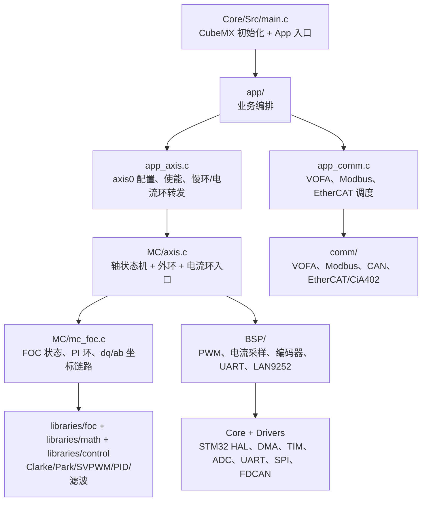
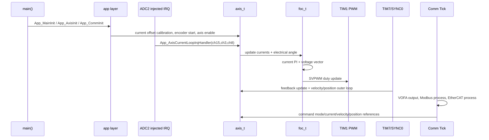

# h7FOC - STM32H750 FOC Servo Drive

h7FOC 是一个基于 STM32H750 的电机控制工程，目标是把 PMSM/BLDC 的 FOC 闭环控制、编码器反馈、电流采样、上位机调试和工业通信协议整合到一套可扩展的伺服驱动固件里。

当前工程重点围绕单轴 `axis0` 打通：TIM1 三相互补 PWM 输出，ADC2 注入采样进入 20 kHz 电流环，多摩川绝对值编码器提供电角度/机械位置反馈，TIM7 或 EtherCAT SYNC0 驱动 1 kHz 慢环，通信侧同时保留 VOFA+、Modbus RTU、CAN 和 LAN9252 EtherCAT/CiA402 接入。

## 面试官快速跳转

| 想看什么 | 入口 | 说明 |
| --- | --- | --- |
| 项目总览与文档导航 | [docs/README.md](docs/README.md) | 所有调试、联调、协议和复盘文档的索引 |
| FOC 控制链路 | [docs/FOC_Usage.md](docs/FOC_Usage.md) | 电流环、速度环、PID 和调试变量说明 |
| 代码封装思路 | [docs/Motor_Encapsulation.md](docs/Motor_Encapsulation.md) | 电机对象、FOC 算法层、硬件抽象层的分层思路 |
| 电机不转排查 | [docs/DEBUG_INSTRUCTIONS.md](docs/DEBUG_INSTRUCTIONS.md) | 从 ADC 中断、FOC enable、PWM 和电流采样逐步定位 |
| FOC 调试指南 | [docs/FOC_DEBUG_GUIDE.md](docs/FOC_DEBUG_GUIDE.md) | FOC 联调过程和关键观测点 |
| HardFault 复盘 | [docs/HardFault_问题复盘.md](docs/HardFault_问题复盘.md) | Cortex-M7、UART DMA、Cache、栈/堆/全局区的故障分析 |
| Modbus 联调 | [docs/Modbus_TEST1一致性核对与联调手册.md](docs/Modbus_TEST1一致性核对与联调手册.md) | TEST1/DriverStudio 兼容性、寄存器和联调验收 |
| EtherCAT 移植 | [docs/EtherCAT_开发移植学习手册.md](docs/EtherCAT_开发移植学习手册.md) | LAN9252、EtherCAT 从站和 CiA402 移植路线 |
| 面试展示页 | [docs/interview_project_showcase.html](docs/interview_project_showcase.html) | 面向展示的 HTML 项目说明页 |

## 项目亮点

- 20 kHz FOC 电流环：ADC2 注入转换完成中断内完成电流更新、Park/Clarke、PI 电流环、反 Park、SVPWM 和 PWM 占空比刷新。
- 1 kHz 慢环：TIM7 默认触发编码器反馈刷新和速度/位置外环；EtherCAT DC 同步开启时可切到 SYNC0 节拍。
- 面向对象的轴封装：`axis_t` 聚合 `foc_t`、PWM、电流采样、编码器接口和状态机，方便后续扩展多轴。
- 多协议调试和控制入口：VOFA+ 实时波形、Modbus RTU 寄存器、FDCAN、LAN9252 EtherCAT/CiA402。
- 嵌入式故障复盘完整：包含 HardFault、DMA/Cache、一致性、UART ReceiveToIdle、协议解析边界等定位记录。

## 硬件组成

| 模块 | 当前工程配置 | 作用 |
| --- | --- | --- |
| 主控 MCU | STM32H750VBT6 / STM32H750VBTx，Cortex-M7，CubeMX 配置 CPU 480 MHz | 运行 FOC 算法、通信协议栈和 FreeRTOS |
| 三相 PWM | TIM1 CH1/CH2/CH3 + CH1N/CH2N/CH3N，中心对齐，ARR=2999，DeadTime=100 | axis0 三相逆变桥驱动，周期约 20 kHz |
| 扩展 PWM | TIM8 三相 PWM 预留 | 第二路功率级或后续多轴扩展 |
| 电流采样 | ADC2 注入通道 CH15/CH3/CH8，TIM1 CC4 触发；ADC1 还配置了常规/注入采样 | 三相电流反馈、偏置校准、闭环电流控制 |
| 位置反馈 | USART2 2.5 Mbps 多摩川编码器；TIM3 编码器模式预留 ABZ 输入 | 机械角度、速度、电角度来源 |
| EtherCAT | LAN9252 + SPI3，外部 IRQ、SYNC0、SYNC1 引脚 | EtherCAT 从站、CiA402 状态机、PDO/SDO 通道 |
| Modbus RTU | USART3 921600 bps + DMA | 上位机寄存器读写、联调和验收 |
| 实时调试 | UART4 115200 bps + DMA，VOFA+ JustFloat | 输出角度、电流、速度、Iq 目标等 8 路浮点波形 |
| CAN | FDCAN1，标称 1 Mbps | 后续控制或诊断总线 |
| 人机/辅助 | LED1/LED2、KEY1/KEY3/KEY4、RS485_RE、DMC1_RE | 调试指示、按键输入和半双工收发控制 |

## 代码架构



### 目录职责

| 目录 | 职责 |
| --- | --- |
| `Core/` | STM32CubeMX 生成的 HAL 初始化、中断向量和系统时钟；用户逻辑只保留 App 转发入口 |
| `app/` | 应用层胶水代码，负责初始化轴、通信、选择 TIM7/SYNC0 慢环来源 |
| `MC/` | 电机控制核心，包含 `axis_t` 状态机和 `foc_t` 算法状态 |
| `BSP/` | 板级驱动抽象，包括 PWM、电流采样、ABZ/多摩川编码器、UART、CAN、LAN9252 |
| `libraries/` | 可复用算法库，包括 PID、FOC 坐标变换、SVPWM、数学函数和滤波器 |
| `comm/` | 通信层，包含 VOFA 调试、Modbus 对象字典、CAN 控制、EtherCAT/CiA402 协议栈 |
| `Middlewares/` | FreeRTOS/CMSIS-RTOS2 |
| `Drivers/` | STM32 HAL、CMSIS、CMSIS-DSP |
| `docs/` | 调试指南、故障复盘、协议联调和面试展示资料 |

## 实时控制流程



关键实时约束：

- 电流环在 ADC 注入转换完成中断内运行，不能做阻塞等待、格式化打印或复杂通信处理。
- 慢环默认由 TIM7 1 ms 节拍触发；EtherCAT DC 同步有效时，外环命令应用可切到 SYNC0。
- STM32H7 上 DMA 与 Cache/内存区域强相关，电流采样和串口 DMA 缓冲需要放在 DMA 可访问 RAM，并配合 Cache 维护。

## 控制与通信接口

- 电流/力矩模式：直接设置 `Iq` 目标，适合底层电流环验证和力矩控制。
- 速度模式：速度 PI 输出 `Iq` 目标，电流环继续保持 20 kHz。
- 位置模式：位置环输出速度目标，速度环再输出 `Iq` 目标。
- Modbus RTU：通过对象字典读写轴状态、模式、目标值和反馈。
- EtherCAT/CiA402：映射控制字、模式、目标位置/速度和状态字，支持 CSP/CSV/CST 的接口方向。
- VOFA+：周期输出 8 路浮点变量，用于观察电角度、机械位置、三相电流、速度、`Iq` 和目标 `Iq`。

## 构建与下载

主构建方式是 CMake + GCC ARM 工具链：

```bash
cmake -B build -DCMAKE_BUILD_TYPE=Debug
cmake --build build
```

也可以使用 Keil MDK：

- 工程文件：`MDK-ARM/h7FOC.uvprojx`
- 目标芯片：STM32H750VBTx
- 下载方式：ST-Link / OpenOCD / STM32CubeProgrammer，按本地硬件连接选择

## 调试建议

1. 新硬件第一次上电先只验证 PWM、ADC 偏置和编码器反馈，不要直接闭环加大电流。
2. 电机不转时按 [DEBUG_INSTRUCTIONS.md](docs/DEBUG_INSTRUCTIONS.md) 从 ADC 中断、FOC enable、PWM 占空比、电流值逐项排查。
3. 出现 HardFault 时先保存 `PC/LR/CFSR/HFSR/BFAR`，再对照 [HardFault_问题复盘.md](docs/HardFault_问题复盘.md) 判断是非法跳转、栈破坏、DMA/Cache 还是中断状态机问题。
4. 协议联调先用 Modbus 验证对象字典和轴控制，再切 EtherCAT/CiA402，降低一次性问题面。

## 文档入口

所有面试展示、调试记录和联调手册都集中在 [docs/](docs/)：

- [docs/README.md](docs/README.md)：文档总目录和推荐阅读顺序
- [docs/FOC_Usage.md](docs/FOC_Usage.md)：FOC 使用说明
- [docs/Motor_Encapsulation.md](docs/Motor_Encapsulation.md)：电机封装架构说明
- [docs/DEBUG_INSTRUCTIONS.md](docs/DEBUG_INSTRUCTIONS.md)：电机不转排查指南
- [docs/FOC_DEBUG_GUIDE.md](docs/FOC_DEBUG_GUIDE.md)：FOC 调试指南
- [docs/HardFault_问题复盘.md](docs/HardFault_问题复盘.md)：HardFault 复盘
- [docs/Modbus_TEST1一致性核对与联调手册.md](docs/Modbus_TEST1一致性核对与联调手册.md)：Modbus 联调手册
- [docs/EtherCAT_开发移植学习手册.md](docs/EtherCAT_开发移植学习手册.md)：EtherCAT 移植手册
