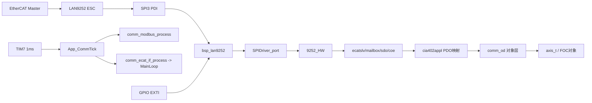
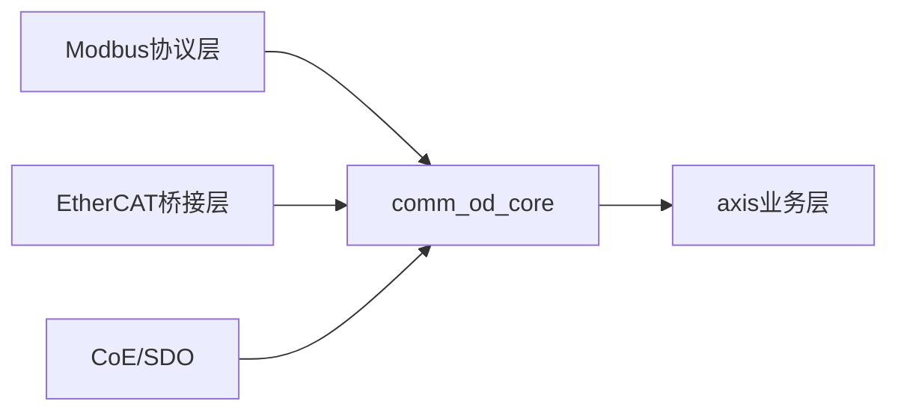

# h7FOC EtherCAT 开发与移植学习手册（面向初学者）

> 适用项目：`C:/Users/ASUS/Desktop/STM32demo/h7FOC`
> 目标读者：第一次做 EtherCAT 从站移植、希望看懂现有代码并能继续迭代的开发者

---

## 1. 你当前项目到哪一步了（先建立全局感）

你现在不是从 0 开始，而是已经完成了以下关键里程碑：

1. 通信架构分层：`app / BSP / comm / MC` 已建立。
2. Modbus RTU 已打通，并通过 `comm_od` 访问电机对象。
3. EtherCAT SSC（Beckhoff Slave Stack Code）代码已接入：`comm/Eth_stack/*`。
4. LAN9252 SPI 驱动链路已接入：`SPIDriver + 9252_HW + SPIDriver_port + bsp_lan9252`。
5. TIM7 1ms 节拍已经并入通信慢循环，`comm_ecat_if_process()` 已周期调用。

这意味着你已经进入“从可编译接入，走向实时一致性和工程化稳定性”的阶段。

---

## 2. 基础知识（初学者必须先吃透的 EtherCAT 心智模型）

### 2.1 EtherCAT 到底是什么

EtherCAT 是工业以太网实时总线。可以理解为：

1. 主站每个周期发一帧数据。
2. 从站在帧经过时边读边写（on-the-fly）。
3. 不需要每站都完整收发整包，所以延迟低、同步能力强。

伺服场景价值：

1. 周期确定性高（jitter 小）。
2. 多轴同步容易（配合 DC）。
3. PDO 延迟低、吞吐高。

### 2.2 你工程里的角色分工

1. STM32H750：跑 FOC、业务逻辑、Modbus、SSC 调用。
2. LAN9252：ESC（EtherCAT Slave Controller），负责 EtherCAT 实时协议侧。
3. SPI3：STM32 与 LAN9252 的 PDI（Process Data Interface）。

重点：LAN9252 不是普通网卡，而是带 EtherCAT 状态机和 DPRAM 的从站控制器。

### 2.3 ESM（EtherCAT State Machine）必知

标准状态流：

1. INIT
2. PRE-OP
3. SAFE-OP
4. OP

记忆方式：

1. INIT：先初始化起来。
2. PRE-OP：邮箱可用（SDO 通道）。
3. SAFE-OP：输入可更新，输出受保护。
4. OP：完整实时控制状态。

你代码里 `MainLoop()` 驱动 ESM 和邮箱协议循环；`comm_ecat_if_init()` 里做了 `MainInit()`、`CiA402_Init()`、`APPL_GenerateMapping()`。

### 2.4 PDO 与 SDO 区别

1. PDO
- 周期实时数据通道。
- 用于控制字、目标值、状态反馈。
- 追求低延迟，语义轻。

2. SDO
- 邮箱参数服务通道。
- 用于配置、调参、诊断对象访问。
- 语义完整，实时性低于 PDO。

工程原则：实时变量走 PDO，配置诊断走 SDO。

### 2.5 CiA402 是什么

CiA402 是伺服驱动轮廓标准。你当前用的是 SSC 自带样例应用 `cia402appl.c`，已具备：

1. 控制字 `0x6040`
2. 状态字 `0x6041`
3. 目标位置 `0x607A`
4. 目标速度 `0x60FF`
5. 实际位置 `0x6064`
6. 实际速度 `0x606C`

这让主站侧工具更容易兼容。

### 2.6 DC（Distributed Clocks）为什么重要

DC 的核心是“全网统一时基”，意义在于：

1. 多轴动作对齐。
2. 周期抖动可控。
3. OP 状态下同步性能更稳定。

你的 `PLAN.md` 已明确后续做 TIM7/SYNC0 调度源切换，这是工业化关键步骤。

---

## 3. 当前代码架构解剖（结合真实文件）

### 3.1 顶层运行链路

主流程：

1. `Core/Src/main.c`
2. `App_MainInit()`
3. `App_AxisInit()`
4. `App_CommInit()`
5. TIM7 1ms 回调中执行：
- `bsp_lan9252_on_1ms_tick()`
- `App_AxisSlowLoopTick()`
- `App_CommTick()`

`App_CommTick()` 里执行：

1. VOFA 分频发送
2. `comm_modbus_process()`
3. `comm_ecat_if_process()`（内部跑 `MainLoop()`）

### 3.2 EtherCAT 驱动分层

建议你把当前分层记成 5 层：

1. 板级层：`BSP/bsp_lan9252.c/.h`
2. 端口层：`comm/Eth_stack/SPIDriver_port.c/.h`
3. LAN9252 访问层：`SPIDriver.c + 9252_HW.c`
4. 协议栈层：`ecatslv/mailbox/sdoserv/ecatcoe/cia402appl`
5. 项目接口层：`comm/protocol/comm_ecat_if.c`

这条分层路径对后续跨平台移植非常友好。

### 3.3 Modbus 与对象层

当前 `comm_od.c` 已承担统一入口雏形：

1. `comm_od_bind_axis0()` 绑定业务对象。
2. `comm_od_read_*`/`comm_od_write_*` 完成寄存器与变量映射。
3. `comm_modbus.c` 负责帧解析、CRC、异常码，协议与对象解耦清晰。

---

## 4. 开发日志复盘（从提交看演进节奏）

近阶段提交显示你是“先架构、再协议、再统一”的正确路线：

1. 2026-04-12：分层、axis 抽象、Modbus 打通。
2. 2026-04-17：SSC 接入、LAN9252 驱动接入、1ms EtherCAT 周期引入、对象字典思路落地。

这个节奏是对的，不要倒回“先堆功能再整理架构”的老路。

---

## 5. 结合 `PLAN.md` 的状态评估

`C:/Users/ASUS/Desktop/PLAN.md` 的核心方向是：

1. 统一通信真值层（SDO/Modbus 通用 API + PDO 快路径）。
2. 并发一致性（快照/版本化提交，防撕裂）。
3. 字节序边界清晰（核心层小端统一，Modbus 显式大端编解码）。
4. DC 下调度源接管（TIM7 与 SYNC0）。

当前状态：

1. 已有 EtherCAT 框架与调度入口。
2. 已有 comm_od 统一入口雏形。
3. 尚未完成 `comm_od_core` 真值层与 PDO 快路径分离。
4. 尚未完成快照一致性和 TIM7/SYNC0 切换控制面。

---

## 6. 架构设计思维（你后续开发的“方法论”）

### 6.1 协议与真值分离

正确做法：

1. 真值层只放业务语义（目标位置、反馈速度）。
2. 协议层只做编解码与对象映射。
3. 任何协议细节不进入控制核心。

### 6.2 热路径与冷路径分离

1. 热路径（中断/PDO/控制周期）
- 少分支、少锁、少查表。

2. 冷路径（SDO/Modbus/诊断）
- 完整检查、权限控制、容错优先。

### 6.3 并发一致性优先于“看起来简洁”

典型风险：32/64 位变量跨上下文读写撕裂。
建议：shadow 写入 + 版本提交 + 读侧固定版本快照。

### 6.4 可移植性靠窄接口

你已经在做对的事：把板级差异收敛到 `bsp_lan9252` 与 `SPIDriver_port`。
继续坚持：协议层不要直接依赖 HAL 细节。

---

## 7. 初学者实战移植路线（阶段化）

### 阶段 A：先活起来

目标：主站能识别从站并进 PRE-OP。

1. SPI/CS/IRQ/SYNC 引脚确认。
2. `bsp_lan9252` 收发确认。
3. `comm_ecat_if_init()` 初始化链路确认。
4. TIM7 周期跑 `MainLoop()`。

### 阶段 B：最小 PDO 闭环

目标：OP 下能收命令、回反馈。

1. 固定最小 PDO 集合（控制字、目标值、状态字、实际值）。
2. 对齐 CiA402 状态机变化与控制逻辑。

### 阶段 C：统一真值层

目标：Modbus/SDO/PDO 读写一致。

1. 引入 `comm_od_core`。
2. 通用 API 与快路径 API 分离。
3. 完成跨协议一致性验证。

### 阶段 D：工业级实时

目标：并发稳定 + DC 同步可控。

1. 快照一致性机制。
2. TIM7/SYNC0 调度切换框架。
3. OP+DC 压测验证。

---

## 8. 当前工程调试重点

1. 初始化链路失败定位：`bsp_lan9252`、`HW_Init()`、`MainInit()` 分段打点。
2. EXTI 触发链路确认：`HAL_GPIO_EXTI_Callback()` -> `bsp_lan9252_handle_exti()`。
3. 1ms 时基确认：TIM7 中断实际频率与占用。
4. 字节序检查：Modbus 大端帧、EtherCAT 对象解释一致性。
5. 状态机检查：先 PRE-OP，再 SAFE-OP，再 OP。

---

## 9. 关键文件索引

1. `C:/Users/ASUS/Desktop/STM32demo/h7FOC/comm/protocol/comm_ecat_if.c`
2. `C:/Users/ASUS/Desktop/STM32demo/h7FOC/BSP/bsp_lan9252.c`
3. `C:/Users/ASUS/Desktop/STM32demo/h7FOC/comm/Eth_stack/SPIDriver_port.c`
4. `C:/Users/ASUS/Desktop/STM32demo/h7FOC/comm/Eth_stack/9252_HW.c`
5. `C:/Users/ASUS/Desktop/STM32demo/h7FOC/comm/Eth_stack/ecatslv.c`
6. `C:/Users/ASUS/Desktop/STM32demo/h7FOC/comm/Eth_stack/cia402appl.c`
7. `C:/Users/ASUS/Desktop/STM32demo/h7FOC/comm/protocol/comm_od.c`
8. `C:/Users/ASUS/Desktop/STM32demo/h7FOC/comm/protocol/comm_modbus.c`
9. `C:/Users/ASUS/Desktop/STM32demo/h7FOC/Core/Src/main.c`
10. `C:/Users/ASUS/Desktop/STM32demo/h7FOC/Core/Src/stm32h7xx_it.c`

---

## 10. 一图看懂当前系统

---

## 11. 常见误区

1. 把 EtherCAT 当普通串口协议写。
2. 在热路径做复杂解析和大逻辑分支。
3. 不区分 PDO/SDO/Modbus 的职责边界。
4. 不做统一真值层，导致协议间值不一致。
5. 一次改太多，无法回归定位。

---

## 12. 下一步建议（按风险最小顺序）

1. 先落地 `comm_od_core` 真值层。
2. 再拆分通用 API 与 PDO 快路径 API。
3. 然后加快照一致性机制。
4. 最后做 TIM7/SYNC0 调度切换与 DC 强化验证。

---

## 13. 术语速查

1. ESC：EtherCAT 从站控制器
2. ESM：EtherCAT 状态机
3. PDO：过程数据对象
4. SDO：服务数据对象
5. CoE：CANopen over EtherCAT
6. CiA402：驱动轮廓标准
7. DC：分布式时钟
8. SM：Sync Manager
9. PDI：处理器数据接口

---

## 14. 文档基线说明

本手册基于以下内容整理：

1. 当前仓库代码结构与关键文件实现。
2. `C:/Users/ASUS/Desktop/PLAN.md`（v6 计划）。
3. 最近阶段提交日志（重点含 2026-04-17 EtherCAT 接入相关提交）。

建议后续在本文件追加 “v2 实施记录” 章节，持续沉淀你的 EtherCAT 工程知识库。

---

## 15. 协议栈逐函数讲义（第 1 讲：MainInit / MainLoop / ECAT_Application）

这一讲的目标不是“记住函数名”，而是理解一件事：
**协议栈每 1ms 到底干了什么，哪些是协议层职责，哪些是应用层职责。**

### 15.1 先抓调用主链

从工程入口到协议栈主循环，当前路径是：

1. `Core/Src/main.c` 初始化完外设后调用 `App_CommInit()`。
2. `HAL_TIM_PeriodElapsedCallback()` 里 `htim7` 每 1ms 调 `App_CommTick()`。
3. `App_CommTick()` 内同时调 `comm_modbus_process()` 和 `comm_ecat_if_process()`。
4. `comm_ecat_if_process()` 内调用 SSC 的 `MainLoop()`。

也就是说：你的 EtherCAT 不是在 `while(1)` 里跑，而是在 TIM7 慢周期调度里跑。

### 15.2 MainInit 做了什么（只看初始化语义）

`MainInit()` 的职责是“把栈启动到可运行态”：

1. 清理应用回调指针（防止残留状态）。
2. 调 `ECAT_Init()`，初始化 ESM、同步管理器、AL 状态等协议核心状态。
3. 调 `COE_ObjInit()`，初始化 CoE 对象体系。
4. 置位 `bInitFinished`，允许后续 `MainLoop()` 进入正常执行路径。

设计思维：
`MainInit()` 是“一次性启动门”，`MainLoop()` 是“周期执行器”。

### 15.3 MainLoop 做了什么（按执行顺序）

`MainLoop()` 可以拆成 6 步：

1. **初始化门禁检查**
- 如果 `bInitFinished == FALSE`，直接返回。

2. **过程数据处理模式判断**
- 根据 `bEscIntEnabled`、`bEcatFirstOutputsReceived`、`bDcSyncActive` 判断当前是 FreeRun、SM 同步还是 DC 同步语境。

3. **必要时执行应用过程数据处理**
- 在非 DC 且中断条件不足时，主循环兜底执行 `ECAT_Application()` 与 PDO 映射。
- 执行前后会关中断/开中断，减少映射窗口的并发扰动。

4. **软件定时检查**
- 用 `HW_GetTimer()` 检查周期，超阈值时调 `ECAT_CheckTimer()` 并 `HW_ClearTimer()`。

5. **调用协议主循环**
- 调 `ECAT_Main()` 处理 AL Event、状态机转移、邮箱读写、SM 变化。

6. **调用高层协议与轮廓逻辑**
- `COE_Main()`
- `CheckIfEcatError()`
- `CiA402_StateMachine()`
- 如果注册了 `pAPPL_MainLoop`，再调用应用扩展回调。

设计思维：
`MainLoop()` 是分层调度器，不直接写业务对象，按“协议层 -> 轮廓层 -> 应用层”顺序推进。

### 15.4 ECAT_Application 的角色

`ECAT_Application()` 的定位是“协议层给应用层的周期钩子”，内部核心是调用 `APPL_Application()`。

在你的工程中，`APPL_Application()` 在 `cia402appl.c` 内部按轴调用 CiA402 应用逻辑。

设计思维：
协议栈不直接耦合电机控制细节，而是通过标准回调把时机交给应用层。

---

## 16. 对象字典深入讲解（你当前引入方式的工程价值）

### 16.1 你现在有两套“字典”，要分清

1. **EtherCAT CoE 对象字典**
- 形态：`Index/SubIndex -> pVarPtr(变量地址)`
- 服务对象：SDO + PDO + CiA402

2. **comm_od 寄存器字典（你自定义）**
- 形态：`Modbus RegAddr -> axis字段/控制接口`
- 服务对象：Modbus

这两套本质思想相同：都是“协议地址空间 -> 业务语义变量”的路由器。

### 16.2 CoE 对象字典怎么建起来

在 `CiA402_Init()` 中做了两类关键动作：

1. 初始化每轴对象容器 `LocalAxes[Axis].Objects`。
2. 逐项把对象索引绑定到变量地址 `pVarPtr`，例如：
- `0x6040` -> `objControlWord`
- `0x6041` -> `objStatusWord`
- `0x607A` -> `objTargetPosition`
- `0x60FF` -> `objTargetVelocity`

接着在 `APPL_GenerateMapping()` 中根据 PDO 分配情况动态 `COE_AddObjectToDic()` 或 `COE_RemoveDicEntry()`，
让“激活轴对应对象”进入全局可访问字典。

设计思维：
对象字典不是死表，而是可随映射动态变化的运行时结构。

### 16.3 SDO 访问字典的真实路径

SDO 收到读写请求后，关键链路是：

1. `OBJ_GetObjectHandle(index)` 找对象。
2. `OBJ_Read(...)` 或 `OBJ_Write(...)` 完成变量访问。

这就是为什么你会在 `sdoserv.c` 看到大量 `OBJ_*` 调用：SDO 本质是“通过字典访问对象变量”。

### 16.4 PDO 与字典的关系

1. `APPL_OutputMapping()`：把主站下发 RxPDO 解包写入对象。
2. `APPL_InputMapping()`：把对象状态打包成 TxPDO 上报主站。

因此你可以把字典理解为“对象地址中枢”，而 PDO 是“周期搬运通道”。

---

## 17. Modbus 代码深度讲解（与你的对象层设计）

### 17.1 comm_modbus_process 的职责边界

`comm_modbus_process()` 的职责非常干净：

1. 收帧 `bsp_uart_comm_fetch_frame(...)`
2. CRC 校验
3. 校验从站地址
4. 按功能码分发（03/04/06/10）
5. 发送响应帧

它不直接写 axis，不直接耦合 FOC 细节。

### 17.2 真正业务访问在 comm_od

`comm_modbus_bind_axis0()` 先把 `axis` 绑定到 `comm_od`。

后续所有读写都经过：

1. `comm_od_read_holding_word()`
2. `comm_od_read_input_word()`
3. `comm_od_write_single()`
4. `comm_od_write_multi_words()`

设计思维：
你已经把“协议处理”和“业务变量映射”分开，这是后续做 EtherCAT/Modbus 真值统一的前提。

### 17.3 你当前 comm_od 的现状与下一步

当前 `comm_od` 是直接映射 `axis_t` 字段。
这对快速打通很好，但下一步（按 `PLAN.md`）建议升级为：

1. 引入 `comm_od_core` 真值层（协议无关）。
2. Modbus/SDO 用通用 API（安全、可校验）。
3. PDO 用快路径视图（降低热路径开销）。

---

## 18. 设计思维总结（你后续写代码时的检查清单）

每次改协议相关代码前，先问自己 4 个问题：

1. 这是协议层逻辑，还是对象层逻辑，还是控制层逻辑？
2. 热路径里有没有不必要的分支/查表/锁？
3. 多字节变量会不会被并发读写撕裂？
4. 这次改动是否破坏了“多协议同真值”的方向？

如果这 4 个问题都能回答清楚，你写出来的代码基本就不会跑偏。

---

## 19. 第 2 讲预告（下一步继续）

下一讲建议你重点攻克：

1. `ECAT_Main()`：AL Event 怎么驱动状态机、邮箱和 SM 事件。
2. `AL_ControlInd()`：INIT/PREOP/SAFEOP/OP 转移条件是什么。
3. `AL_ControlRes()`：pending 状态是怎么收尾的。
4. `CheckIfEcatError()`：看门狗、同步错误如何把从站拉回 SAFEOP。

这部分吃透后，你就能真正看懂“为什么主站进不了 OP、为什么会掉 SAFEOP”。

---

## 20. 协议栈逐函数讲义（第 2 讲：ECAT_Main / AL_ControlInd / AL_ControlRes）

这一讲目标是看懂 EtherCAT 状态机如何真正被驱动，特别是：

1. 主站写 AL Control 后，栈怎么切状态。
2. 为什么会出现 pending 状态。
3. 为什么会掉到 SAFEOP（看门狗/同步错误）。

### 20.1 ECAT_Main：事件分发中枢

`ECAT_Main()` 在 `ecatslv.c` 中是主事件循环入口。

核心流程可以概括为：

1. 先跑 `MBX_Main()`，处理邮箱后台。
2. 读 AL Event 寄存器（ESC 事件源）。
3. 如果有 `AL_CONTROL_EVENT`，读取 AL Control 寄存器并调用 `AL_ControlInd(...)`。
4. 如果有 `SM_CHANGE_EVENT`，调用 `AL_ControlInd(当前状态, 0)` 去重新校验 SM 配置。
5. 如果有 pending 状态转移，调用 `AL_ControlRes()` 收尾。
6. 再处理邮箱读事件、repeat request、邮箱写事件。

这就是协议栈“消息泵”。

设计思维：
`ECAT_Main` 不做业务算法，只做“事件识别 -> 对应处理函数派发”。

### 20.2 AL_ControlInd：状态转换决策器

`AL_ControlInd(UINT8 alControl, UINT16 alStatusCode)` 的要点：

1. 先处理错误确认位（STATE_CHANGE 位）。
2. 计算 `stateTrans`（旧状态 + 新状态组合）。
3. 按状态转移类型做 `CheckSmSettings(...)`。
4. 对 PREOP->SAFEOP 会先 `APPL_GenerateMapping(...)`，因为 PDO 长度和映射可能变化。
5. 若检查通过，执行对应转移路径（启动/停止 mailbox、input handler、output handler 等）。
6. 若失败，保留或降级状态并写 AL Status Code。

设计思维：
状态转移不是“主站说了算”，而是“主站请求 + 本地配置校验 + 本地应用确认”三者共同决定。

### 20.3 AL_ControlRes：pending 状态收尾器

当某些转移函数返回 `NOERROR_INWORK` 时，表示“异步处理中”，栈会进入 pending。
后续由 `AL_ControlRes()` 判断是否可完成转移并写最终 AL Status。

这也是你看到“主站请求了但状态没立刻变”的根本原因。

### 20.4 同步/看门狗错误如何触发降级

`CheckIfEcatError()` 与 `DC_CheckWatchdog()` 负责检查：

1. SM 看门狗是否超时。
2. DC 同步是否运行。
3. SM/Sync 序列是否有效。

当检测到错误会通过 `AL_ControlInd(STATE_SAFEOP, error_code)` 拉回 SAFEOP。

设计思维：
工业协议优先“安全降级”，不是“硬撑 OP”。

---

## 21. 新开发增量解读（2026-04-17 阶段 1~5）

你最近新增的代码已经从“接入栈”升级到了“可控调度 + 快速桥接 + 并发稳态”。

下面按模块解释。

### 21.1 comm_ecat_if：从薄封装升级为控制中枢

`comm_ecat_if.h/.c` 新增了完整的控制面接口：

1. 触发源切换：`COMM_ECAT_TRIGGER_TIM7` / `COMM_ECAT_TRIGGER_SYNC0`
2. 健康状态读取：`comm_ecat_if_is_healthy()`
3. SYNC0 中断入口：`comm_ecat_if_on_sync0_irq()`
4. RxPDO 快速注入：`comm_ecat_if_on_rxpdo(...)`
5. TxPDO 填充：`comm_ecat_if_fill_txpdo(...)`

并且 `comm_ecat_if_process()` 已支持：

1. TIM7 模式每 tick 运行。
2. SYNC0 模式仅在 `g_sync0_pending` 置位后运行。
3. 每次运行前后做：反馈写回 CiA402 -> `MainLoop()` -> 应用命令 -> 健康轮询。

设计思维：
你把“协议栈运行时机”和“业务对象同步”统一收敛到了 `comm_ecat_if`，这一步非常关键。

### 21.2 app_comm：根据 DC 状态动态切换触发源

`App_CommTick()` 现在会根据 `bDcSyncActive` 自动切换：

1. 非 DC：TIM7 触发。
2. DC 激活：SYNC0 触发。

这与 `PLAN.md` 的“调度源接管机制”已经对齐，属于从架构设计到代码实现的实质落地。

### 21.3 ecatappl + cia402appl：完成 PDO 快速桥接钩子

你现在已经把桥接钩子打通：

1. `Sync0_Isr()` 中调用 `comm_ecat_if_on_sync0_irq()`。
2. `APPL_OutputMapping()` 中调用 `comm_ecat_if_on_rxpdo(...)` 注入下行命令。
3. `APPL_InputMapping()` 中调用 `comm_ecat_if_fill_txpdo(...)` 填充上行反馈。

这使得 EtherCAT PDO 与 axis/FOC 的链路从“纯 SSC 示例路径”变成“项目可控桥接路径”。

### 21.4 comm_od：写路径并发保护增强

`comm_od.c` 新增了局部临界区封装：

1. `comm_od_irq_lock()` / `comm_od_irq_unlock()`
2. 在关键写路径（模式切换、目标值更新、PI 参数写入）加短临界区提交

这一步是你防止撕裂值、提升多协议并发安全性的基础版本。

### 21.5 当前增量对应的学习重点

你现在应该重点验证 3 件事：

1. 触发源切换后，`SYNC0` 模式下是否只在 `sync0 pending` 时跑 EtherCAT 主循环。
2. RxPDO 注入后，`comm_ecat_apply_cia402_commands()` 是否稳定映射到 `axis`。
3. Modbus 写参与 EtherCAT 周期同时运行时，是否还出现参数撕裂。

---

## 22. 第二阶段阅读任务（建议按顺序）

为了完全吃透新增开发，建议按下面顺序读源码：

1. `comm/protocol/comm_ecat_if.h`（先看接口全貌）
2. `comm/protocol/comm_ecat_if.c`（看 trigger/sync0/shadow/health 四块）
3. `app/app_comm.c`（看 DC 条件下触发源切换）
4. `comm/Eth_stack/ecatappl.c`（看 `Sync0_Isr()` 钩子）
5. `comm/Eth_stack/cia402appl.c`（看 Input/Output Mapping 钩子）
6. `comm/protocol/comm_od.c`（看并发保护如何包裹写路径）

如果你能把这 6 步走完，就能真正理解“你自己的 EtherCAT 移植架构”而不是停留在 SSC 示例层。

---

## 23. 协议栈逐函数讲义（第 3 讲：`comm_ecat_if.c` 全链路白话拆解）

这一讲只做一件事：
把 `comm_ecat_if.c` 当成“你项目 EtherCAT 的控制中枢”逐段看懂。

建议你打开文件后按本节顺序对照阅读。

### 23.1 先看文件头：这个模块到底负责什么

`comm_ecat_if.c` 同时包含了：

1. SSC 入口调用（`MainInit` / `MainLoop` / `CiA402_Init` / `APPL_GenerateMapping`）
2. 业务对象桥接（`g_axis0` 与 `LocalAxes[0].Objects`）
3. 运行时调度控制（TIM7 / SYNC0）
4. 健康监测
5. RxPDO/TxPDO 快速桥接接口

你可以理解为：
**它不是单纯 wrapper，而是“协议栈 + 业务层之间的协调器”。**

### 23.2 数据结构与状态变量（理解并发前提）

重点变量：

1. `g_ecat_ready / g_ecat_failed / g_ecat_health_ok`
- 分别表示：可运行、初始化失败、健康状态。

2. `g_trigger_source`
- 当前触发源（TIM7 或 SYNC0）。

3. `g_sync0_pending`
- SYNC0 到来后置位，`comm_ecat_if_process()` 消费后清零。

4. `g_rxpdo_shadow + g_rxpdo_seq`
- RxPDO 的 shadow 缓冲与版本序列。
- 用“序号前后相等且偶数”的方式做一致性快照读取。

设计思维：
这套变量组合把“异步输入（IRQ/PDO）”和“同步执行（process）”解耦了。

### 23.3 `comm_ecat_if_init()`：失败路径比成功路径更重要

初始化顺序：

1. `bsp_lan9252_init_default()`
2. `HW_Init()`
3. `MainInit()`
4. `CiA402_Init()`
5. `APPL_GenerateMapping(...)`

任何一步失败：

1. `g_ecat_failed = 1`
2. `g_ecat_health_ok = 0`
3. 直接返回

成功后统一做状态清零与默认值设置（包括 shadow、trigger、health 计数）。

设计思维：
你现在的初始化是“全通过才 ready”，这比“部分成功也继续跑”更适合工业控制系统。

### 23.4 `comm_ecat_if_process()`：真正的执行门控

这个函数决定“本周期是否跑 MainLoop”：

1. 如果 `!g_ecat_ready`，直接返回。
2. TIM7 模式：每次都允许运行。
3. SYNC0 模式：只有 `g_sync0_pending != 0` 才运行，并消费掉 pending。
4. 若不运行，直接 return。

真正运行时顺序：

1. `comm_ecat_update_feedback_to_cia402()`
2. `MainLoop()`
3. `comm_ecat_apply_cia402_commands()`
4. `comm_ecat_health_poll()`

设计思维：
这是“先把本地反馈写回对象，再跑协议，再把命令落到业务”的闭环顺序。

### 23.5 `comm_ecat_update_feedback_to_cia402()`：业务到对象回写

这个函数把 axis 实际状态回写到 CiA402 对象：

1. 先通过 `comm_ecat_if_fill_txpdo(...)` 取本地反馈数据。
2. 再写到 `LocalAxes[0].Objects` 的状态字、实际位置、实际速度、力矩等字段。

意义：
`APPL_InputMapping()` 随后打包 TxPDO 时拿到的就是这里更新后的值。

### 23.6 `comm_ecat_apply_cia402_commands()`：对象到业务落地

这是最关键的“命令执行器”：

1. 先从 `g_rxpdo_shadow` 用序列号读一致性快照。
2. 若快照有效，用快照中的 control/mode/target 覆盖对象当前值。
3. 根据 CiA402 mode 映射到 `axis_mode_t`。
4. 解析 control word 的使能请求，决定 `axis_enable/disable`。
5. 在位置模式下更新位置目标并判断是否触发 move。
6. 在速度模式下更新速度参考。

设计思维：
你把“PDO 输入值”和“轴控制命令”之间加了一层明确的语义转换，这是工程上非常必要的防火墙。

### 23.7 `comm_ecat_if_on_rxpdo(...)`：写 shadow 的并发策略

该函数执行“写序号 -> 写数据 -> 置 valid -> 写序号”：

1. `g_rxpdo_seq++`（进入写中）
2. 更新 shadow 字段
3. `valid = 1`
4. `g_rxpdo_seq++`（提交完成）

配合读侧“前后序号一致且为偶数”的读取逻辑，实现轻量一致性。

这是你当前版本最重要的并发安全增强之一。

### 23.8 `comm_ecat_if_fill_txpdo(...)`：统一上行数据口

这个函数负责填充上报用字段：

1. 状态字（由 `comm_ecat_build_status_word()`构建）
2. 实际位置、速度（带 scale）
3. 模式显示、力矩

意义：
把“本地反馈数据来源”统一成一个函数，后续更换真值层时影响面最小。

### 23.9 `comm_ecat_if_on_sync0_irq()` 与触发切换

`comm_ecat_if_on_sync0_irq()`只做一件事：`g_sync0_pending = 1`。

它不在中断里跑重逻辑，真正处理在 `comm_ecat_if_process()`。

设计思维：
中断里只置标志，主循环里做重活，这是经典实时系统实践。

### 23.10 健康监测 `comm_ecat_health_poll()`

策略：

1. 分频轮询 AL Status（不是每次 process 都读）。
2. 遇到 `0x0000/0xFFFF` 等异常连续计数。
3. 超阈值才判不健康，避免偶发抖动误报。

设计思维：
你实现的是“抗噪的健康判定”，不是瞬时值判定。

---

## 24. 第 3 讲配套断点调试清单（建议一次只看一条链路）

### 24.1 先验证触发源切换链路

断点顺序：

1. `App_CommTick()` 内 `comm_ecat_if_set_trigger_source(...)`
2. `comm_ecat_if_process()` 的 `run_now` 判定
3. `comm_ecat_if_on_sync0_irq()`

你应看到：

1. 非 DC 时每 tick 运行。
2. DC 时只有先收到 SYNC0 pending 才运行一次。

### 24.2 再验证 PDO 下行到 axis 链路

断点顺序：

1. `APPL_OutputMapping()` 中 `comm_ecat_if_on_rxpdo(...)`
2. `comm_ecat_apply_cia402_commands()`
3. `axis_set_mode / axis_set_position_ref / axis_set_velocity_ref`

你应看到：

1. RxPDO 写入先进入 shadow。
2. process 周期再原子读取并下发业务命令。

### 24.3 最后验证上行反馈链路

断点顺序：

1. `comm_ecat_update_feedback_to_cia402()`
2. `comm_ecat_if_fill_txpdo(...)`
3. `APPL_InputMapping()` 打包位置

你应看到：

1. axis 反馈先写到对象。
2. 对象再被打包上行。

---

## 25. 本阶段结论（你现在已经达到的架构成熟度）

到当前阶段，你的 EtherCAT 集成已经从“SSC 示例接入”升级为“项目级可控实现”：

1. 调度时机可控（TIM7/SYNC0）
2. PDO 桥接可控（on_rxpdo/fill_txpdo）
3. 并发风险可控（shadow + seq）
4. 健康状态可观测（health poll）
5. 与 axis 的耦合边界清晰（统一落在 `comm_ecat_if`）

下一步最自然的演进就是：
把 `comm_od` 与 `comm_ecat_if` 共同接入 `comm_od_core` 真值层，彻底实现“多协议同真值”。

---

## 26. 第 4 讲：最新版本增量（自动重试 + 自愈恢复 + 诊断映射 + 软重初始化）

本节对应你最新提交序列（2026-04-17 03:57~04:06）中的关键增强。

### 26.1 `comm_ecat_if` 新增了“启动与恢复”的双路径

你现在把 EtherCAT 启动逻辑收敛到了 `comm_ecat_stack_bootstrap()`：

1. `HW_Init()`
2. `MainInit()`
3. `CiA402_Init()`
4. `APPL_GenerateMapping(...)`

任一步失败即返回失败，不会误置 ready。
并且在“`CiA402_Init` 成功但 `APPL_GenerateMapping` 失败”时，显式 `CiA402_DeallocateAxis()` 做清理，避免资源残留。

设计价值：
从“能启动”升级到了“失败可回收、状态可预测”的工业启动路径。

### 26.2 `comm_ecat_if_process` 语义升级：MainLoop 常跑，轴命令按触发源选择性应用

当前行为（与上一版文档的重要区别）：

1. `MainLoop()` 在 ready 状态下每次 `process` 都执行。
2. 但 `comm_ecat_apply_cia402_commands()` 是否执行，由 `apply_axis_cmd` 决定：
- TIM7 模式：每次应用。
- SYNC0 模式：仅当 `g_sync0_irq_seq_handled != g_sync0_irq_seq` 时应用一次。

这意味着你已经实现了：
**后台状态机持续运行 + 轴控制命令按同步事件节拍落地**。

这是“解耦 MainLoop 与 SYNC0 触发”的核心落地点。

### 26.3 SYNC0 触发机制从“pending 标志”升级为“序号计数”

当前用的是：

1. `comm_ecat_if_on_sync0_irq()` 中 `g_sync0_irq_seq++`
2. `process()` 中比较 `g_sync0_irq_seq_handled` 与 `g_sync0_irq_seq`

相比单 bit pending：

1. 不容易丢事件边沿信息。
2. 便于诊断统计（irq count vs handled count）。

### 26.4 健康监测升级为“可恢复机制”

`comm_ecat_health_poll()` 现在不仅判断健康，还会在异常累计后触发恢复：

1. 连续坏样本超阈值后，进入恢复流程。
2. 停止应用、释放 CiA402、必要时重做 LAN9252 初始化。
3. 重新 `bootstrap`，成功则恢复 healthy 并累计 recovery_successes，失败累计 recovery_failures。

这就是你提交里提到的“链路自愈重试”。

### 26.5 诊断接口显著增强（`comm_ecat_diag_t`）

你现在提供了完整诊断快照接口 `comm_ecat_if_get_diag(...)`，包括：

1. ready / healthy / failed
2. trigger_source
3. bad_health_samples / last_al_status
4. init/recovery 尝试与成功失败计数
5. mainloop_cycles / axis_apply_cycles
6. sync0_irq_count / sync0_irq_handled_count
7. rxpdo_update_count

并在读取时加了临界区，保证快照一致性。

### 26.6 Modbus 输入寄存器已映射 EtherCAT 诊断量

`comm_modbus_regs.h` 增加了一组 `0x0111 ~ 0x0129` 诊断输入寄存器。
`comm_od_read_input_word()` 中通过 `comm_ecat_if_get_diag(...)` 将这些量映射到 Modbus 可读地址。

这使你可以不依赖主站工具，直接从 Modbus/HMI 侧观察 EtherCAT 健康状态与恢复统计。

### 26.7 新增命令寄存器触发软重初始化

新增寄存器：

1. `COMM_MODBUS_REG_CMD_ECAT_REINIT = 0x0204`

在 `comm_od_write_single()` 里：

1. 当该寄存器写非 0 时调用 `comm_ecat_if_force_reinit()`。

`force_reinit` 会清空 ready/health/shadow/sync 计数，等待重新初始化路径接管。
这给调试与现场恢复提供了明确人工干预入口。

### 26.8 自动重试机制（双层）

你现在有两层自动重试：

1. `App_CommTick` 层：未 ready 时每 1000 tick 调一次 `comm_ecat_if_init()`。
2. `comm_ecat_if_process` 层：未 ready 时也有内部重试分频。

这提高了启动恢复概率，但后续建议统一为单一重试入口，避免重复触发和统计口径不一致。

---

## 27. 文档修订说明（与上一版差异）

为和最新代码保持一致，需要特别修订以下认知：

1. **不是“SYNC0 模式下才运行 MainLoop”**
最新是：MainLoop 持续运行，轴命令应用按 SYNC0 节拍门控。

2. **SYNC0 触发不是单 pending 位**
最新是：`irq_seq/handled_seq` 计数比较机制。

3. **健康检测不只是告警**
最新已具备恢复动作和恢复统计。

---

## 28. 你现在可以直接做的验证实验（强烈建议）

### 实验 A：验证“MainLoop 常跑，轴命令门控”

步骤：

1. 断点 `comm_ecat_if_process()` 的 `MainLoop()`。
2. 断点 `comm_ecat_apply_cia402_commands()`。
3. 切到 DC 模式并观察：
- MainLoop 持续命中。
- apply 命中频率由 SYNC0 决定。

### 实验 B：验证诊断寄存器链路

步骤：

1. 通过 Modbus 读取 `0x0111~0x0129`。
2. 人为触发 SYNC0 中断活动，观察 irq count 与 handled count。
3. 观察 mainloop_cycles 是否持续递增。

### 实验 C：验证软重初始化

步骤：

1. Modbus 写 `0x0204 = 1`。
2. 观察 ready/health 变化与 init/recovery 计数变化。
3. 确认系统能回到可运行状态。

---

## 29. 下一步文档计划（继续更新方向）

下一讲建议写成“问题驱动排障手册”，按你现场最常见问题组织：

1. 进不了 OP 怎么排（看 AL 状态与映射）
2. OP 会掉 SAFEOP 怎么排（看看门狗与同步）
3. 有帧但轴不动怎么排（看 apply 门控与 mode/controlword）
4. Modbus 与 EtherCAT 参数不一致怎么排（看对象层与并发写入）

---

## 30. 第 5 讲：问题驱动排障手册（按你当前实现）

本章按现场最常见问题组织，每个问题都给出：

1. 典型现象
2. 最小检查路径
3. 高概率根因
4. 建议修复方向

---

### 30.1 问题 A：主站进不了 OP

典型现象：

1. 只能到 PREOP 或 SAFEOP。
2. 主站报映射/同步/状态转换失败。

最小检查路径：

1. 先看 `comm_ecat_if_get_diag().ready/failed/last_al_status`（可从 Modbus 0x0111~0x0117 及相关寄存器读）。
2. 检查 `comm_ecat_if_init()` 是否完整通过（`HW_Init -> MainInit -> CiA402_Init -> APPL_GenerateMapping`）。
3. 在 `AL_ControlInd()` 看 PREOP->SAFEOP 分支是否在 `APPL_GenerateMapping` 或 `CheckSmSettings` 返回错误。

高概率根因：

1. PDO 映射长度与 SM 配置不匹配。
2. 初始化链路某一步失败后未恢复（已由新版本自愈机制缓解）。
3. 引脚/中断配置不满足（尤其 IRQ/SYNC0/SYNC1）。

建议修复方向：

1. 固定最小 PDO 映射先跑通 OP，再逐项扩展。
2. 用诊断寄存器确认失败来源，不要盲改。
3. 保持 `comm_ecat_stack_bootstrap()` 的失败即返回策略，不要绕过错误。

---

### 30.2 问题 B：能进 OP，但很快掉回 SAFEOP

典型现象：

1. OP 持续时间短，周期性回落 SAFEOP。
2. 偶发恢复后又再次掉线。

最小检查路径：

1. 检查 `CheckIfEcatError()` 与 `DC_CheckWatchdog()` 路径（SM 看门狗、同步错误）。
2. 读诊断：
- `bad_health_samples`
- `last_al_status`
- `recovery_attempts/successes/failures`
3. 检查 `sync0_irq_count` 与 `sync0_irq_handled_count` 是否长期偏差大。

高概率根因：

1. DC 模式下 SYNC0 节拍不稳定或中断丢失。
2. 周期调度与 PDO 更新节拍不一致，导致同步监测失败。
3. 链路噪声导致健康状态持续判坏。

建议修复方向：

1. 先在 TIM7 模式稳定跑通，再切 DC/SYNC0。
2. 把 SYNC0 物理信号与 EXTI 触发可靠性单独验证。
3. 观察恢复统计，确认是“可恢复抖动”还是“持续硬故障”。

---

### 30.3 问题 C：PDO 有流量，但轴不动作

典型现象：

1. 主站可读写对象，状态看似正常。
2. 目标值变化，电机不动或不按预期动。

最小检查路径：

1. 看 `APPL_OutputMapping()` 是否调用 `comm_ecat_if_on_rxpdo(...)`。
2. 看 `comm_ecat_if_process()` 中 `apply_axis_cmd` 是否为 1。
3. 看 `comm_ecat_apply_cia402_commands()` 是否执行到：
- mode 映射
- enable_request 解析
- `axis_set_*` / `axis_request_move`
4. 看 `control_word` 与 `mode_of_operation` 是否符合你的控制语义。

高概率根因：

1. DC 模式下没收到 SYNC0，导致 apply 门控一直不放行。
2. 控制字低 4 位没形成使能请求（`0x000F` 条件不满足）。
3. 模式不匹配（CSP/CSV/CST 与 axis mode 对应关系错误）。

建议修复方向：

1. 调试时先切 TIM7 触发，排除 SYNC0 门控影响。
2. 把 `control_word/mode/target` 打印或断点确认。
3. 单独验证位置模式与速度模式，各自建立最小可运行用例。

---

### 30.4 问题 D：Modbus 与 EtherCAT 参数读写不一致

典型现象：

1. Modbus 写入后 EtherCAT 读值不一致，或反向不一致。
2. 高负载时偶发“跳值/半值”。

最小检查路径：

1. 检查 `comm_od` 读写路径是否都走同一 axis 真值字段。
2. 检查浮点寄存器拆装（高低字）是否统一。
3. 观察并发写入窗口：Modbus 写参与 EtherCAT 周期同时发生时是否撕裂。

高概率根因：

1. 双协议写入时序冲突。
2. 多字节量跨上下文读写没有快照保护。
3. 大端/小端边界在某个适配层被重复转换或漏转换。

建议修复方向：

1. 按 `PLAN.md` 尽快引入 `comm_od_core` 真值层。
2. 保持 Modbus 大端编解码仅在协议层处理。
3. 对关键 32/64 位参数推进 shadow+版本提交机制。

---

### 30.5 问题 E：初始化失败后无法自动恢复

典型现象：

1. 上电失败后长期 `ready=0`。
2. 人工重启才恢复。

最小检查路径：

1. 看 `init_attempts/init_failures` 是否在增长。
2. 看 `App_CommTick` 与 `comm_ecat_if_process` 的重试分频是否执行。
3. 验证 `comm_ecat_if_force_reinit()` 后状态是否被正确清零。

高概率根因：

1. 重试节拍存在但底层硬件状态未恢复（例如引脚/总线异常持续）。
2. 清理动作不完整导致“半初始化状态”卡住。

建议修复方向：

1. 保持“失败后清理再 bootstrap”的完整路径。
2. 区分“初始化失败”和“运行时掉线恢复”统计，避免误判。

---

## 31. 快速排障顺序（建议贴在调试台）

遇到任何 EtherCAT 异常，按这个顺序走：

1. 先看诊断寄存器（ready/healthy/failed/last_al_status/计数器）。
2. 再看触发源与节拍（TIM7 or SYNC0，irq count/handled count）。
3. 再看状态机转移（`AL_ControlInd/AL_ControlRes`）。
4. 再看 PDO 桥接（`on_rxpdo/fill_txpdo`）。
5. 最后看 axis 命令落地（mode/controlword/enable/request_move）。

坚持这个顺序，基本能避免“盲改 + 回归崩盘”。

---

## 32. 第 6 讲：统一真值层改造蓝图（`comm_od_core`）

这一讲的目标是把你现有的两条路径统一起来：

1. Modbus 路径：`comm_modbus -> comm_od -> axis`
2. EtherCAT 路径：`cia402appl/comm_ecat_if -> axis`

改造后的目标是：

1. 两个协议都读写同一个真值层（`comm_od_core`）。
2. 协议层只做编解码，不直接改 axis 业务对象。
3. 热路径（PDO）与冷路径（Modbus/SDO）分离但一致。

---

### 32.1 目标架构（改造后）

关键点：

1. `comm_od_core` 成为唯一真值入口。
2. `axis` 不再被多个协议层直接并发写。
3. 可在核心层做一致性策略（版本、快照、权限）。

---

### 32.2 建议的数据模型（草案）

可以先做“单轴最小模型”：

1. 命令区（主站/上位机写）
- `control_word`
- `mode_of_operation`
- `target_position`
- `target_velocity`
- `target_iq`
- `enable/move_cmd`

2. 参数区（调参写）
- `kp/ki` 等 PI 参数

3. 状态区（控制环写）
- `status_word`
- `actual_position`
- `actual_velocity`
- `actual_torque`
- `move_done`

4. 诊断区（系统写）
- EtherCAT 统计计数、健康状态、最后 AL 状态

建议每个分区带：

1. `version`
2. `valid`
3. `timestamp`（可选）

---

### 32.3 接口草案（建议）

先定义 3 类接口，保持职责清晰：

1. 通用读写接口（冷路径）
- `comm_od_core_read_xxx(...)`
- `comm_od_core_write_xxx(...)`
- 供 Modbus/SDO 使用，带边界检查与权限控制。

2. 快照接口（热路径）
- `comm_od_core_snapshot_rx(...)`
- `comm_od_core_snapshot_tx(...)`
- 供 PDO/控制周期读取，保证同版本一致性。

3. 提交接口（业务刷新）
- `comm_od_core_commit_feedback(...)`
- 由 axis/控制环将反馈统一提交给状态区。

---

### 32.4 并发策略建议（先简单可用）

推荐从“单写多读 + 版本号”开始：

1. 写侧：
- 更新 shadow
- 最后原子提交 `version++`

2. 读侧：
- 读 `v1`
- 读数据
- 读 `v2`
- 仅当 `v1 == v2` 且版本合法时接受

3. 对非常短的关键更新窗口可辅以短临界区。

这样可以先解决 80% 的撕裂问题，再逐步细化。

---

### 32.5 迁移分阶段（建议你按这个顺序落地）

#### 阶段 1：引入核心层但不改行为

1. 新建 `comm/protocol/comm_od_core.h/.c`
2. 定义数据结构与空实现
3. 先把 `comm_od` 改为通过 core 读写（逻辑保持等价）

验收：

1. Modbus 功能不退化
2. 原寄存器读写结果一致

#### 阶段 2：接入 EtherCAT 桥接

1. `comm_ecat_if_on_rxpdo` 改为写 `comm_od_core` 命令区
2. `comm_ecat_if_fill_txpdo` 改为读 `comm_od_core` 状态区
3. `comm_ecat_apply_cia402_commands` 从 core 取命令，不直接混用对象临时值

验收：

1. OP 下轴可正常响应
2. TxPDO 反馈值正确

#### 阶段 3：控制环反馈统一提交

1. 在 axis 慢环或固定点统一调用 `commit_feedback`
2. 清理协议层对 axis 内部字段的直接写访问

验收：

1. Modbus/EtherCAT 同步读反馈一致
2. 并发压测不出现明显撕裂

#### 阶段 4：扩展诊断与权限

1. 核心层统一管理诊断字段
2. 增加只读/可写权限控制
3. 完善错误码与非法访问处理

---

### 32.6 回归验证清单（每阶段都跑）

1. Modbus：
- 03/04/06/10 全功能回归
- float 双寄存器编解码一致

2. EtherCAT：
- PREOP->SAFEOP->OP 转移稳定
- RxPDO 到轴命令链路稳定
- TxPDO 反馈稳定

3. 并发：
- Modbus 连续写参数 + EtherCAT 周期读
- 观察是否有突变、半值

4. 恢复：
- 软重初始化命令后系统能恢复 ready
- 恢复计数与诊断寄存器合理增长

---

### 32.7 设计红线（避免后续返工）

改造时请坚持 4 条红线：

1. 协议层不得直接长期写 axis 内部业务字段（通过 core）。
2. 字节序处理只在协议层，不进入 core。
3. 热路径不做复杂查表与字符串逻辑。
4. 每次改造都保留可观测诊断量，避免黑盒。

---

## 33. 第 6 讲后的行动建议

你可以按以下最小任务开始动手：

1. 先创建 `comm_od_core` 数据结构与读写接口空壳。
2. 将 `comm_od` 切到 core（保持行为不变）。
3. 将 `comm_ecat_if_fill_txpdo/on_rxpdo` 切到 core。

只要这三步完成，你的工程就从“多入口直写业务对象”迈入“统一真值层”阶段了。

---

## 34. 第 7 讲：可开工任务分解（文件级 TODO 清单）

本章给你的是“可以直接照着做”的任务清单。
建议按顺序执行，不要跳步。

### 34.1 任务组 A：创建 `comm_od_core` 骨架

目标：先把核心层文件和数据结构建立起来，不改行为。

文件：

1. `comm/protocol/comm_od_core.h`（新建）
2. `comm/protocol/comm_od_core.c`（新建）
3. `CMakeLists.txt`（加入编译）
4. `MDK-ARM/h7FOC.uvprojx`（若需要手工补工程文件）

TODO：

1. 定义 `comm_od_core_t`（命令区/参数区/状态区/诊断区）。
2. 提供 `init/read/write/snapshot/commit` 函数原型。
3. `init` 中将字段置零并设默认模式。

验收：

1. 工程可编译通过。
2. 不改任何现有运行行为。

---

### 34.2 任务组 B：让 `comm_od` 走 core（行为等价迁移）

目标：Modbus 路径先统一到底层 core。

文件：

1. `comm/protocol/comm_od.h`
2. `comm/protocol/comm_od.c`
3. `comm/protocol/comm_modbus.c`（仅必要改动）

TODO：

1. 在 `comm_od_bind_axis0()` 中同时绑定 axis 与 core 上下文。
2. 把 `comm_od_read_*` 改为从 core 读（不改变寄存器地址语义）。
3. 把 `comm_od_write_*` 改为先写 core，再通过统一 apply 逻辑落地。
4. 保留当前临界区策略，避免回归。

验收：

1. Modbus 03/04/06/10 功能与当前一致。
2. 关键寄存器（目标值、模式、PI 参数）读写结果不变。

---

### 34.3 任务组 C：让 `comm_ecat_if` 走 core（PDO 与真值统一）

目标：EtherCAT 桥接切换到 core，避免直接散写 axis/objects。

文件：

1. `comm/protocol/comm_ecat_if.h`
2. `comm/protocol/comm_ecat_if.c`
3. `comm/Eth_stack/cia402appl.c`（桥接调用处）

TODO：

1. `comm_ecat_if_on_rxpdo()` 写 core 命令区（保留 shadow/seq 一致性）。
2. `comm_ecat_if_fill_txpdo()` 从 core 状态区读取。
3. `comm_ecat_apply_cia402_commands()` 改为消费 core 快照。
4. `comm_ecat_update_feedback_to_cia402()` 改为 core -> CiA402 对象同步。

验收：

1. 主站可进 OP。
2. RxPDO 命令可驱动轴动作。
3. TxPDO 反馈持续正确。

---

### 34.4 任务组 D：控制环反馈统一提交

目标：由 axis/控制环统一向 core 提交反馈，形成单向数据流。

文件：

1. `app/app_axis.c`
2. `MC/axis.c`
3. `comm/protocol/comm_od_core.c`

TODO：

1. 在固定慢环位置调用 `comm_od_core_commit_feedback(...)`。
2. 把位置、速度、电流、状态字等反馈统一写 core。
3. 清理协议层对 axis 反馈字段的直接拼写。

验收：

1. Modbus 与 EtherCAT 读取反馈一致。
2. 高负载下反馈无明显跳变。

---

### 34.5 任务组 E：诊断面统一收敛

目标：把 EtherCAT 统计量和协议诊断字段在 core 内统一管理。

文件：

1. `comm/protocol/comm_ecat_if.c`
2. `comm/protocol/comm_od_core.c`
3. `comm/protocol/comm_od.c`
4. `comm/protocol/comm_modbus_regs.h`

TODO：

1. 将 `comm_ecat_diag_t` 同步到 core 诊断区。
2. `comm_od_read_input_word()` 统一从 core 诊断区取值。
3. 保留 `CMD_ECAT_REINIT` 控制入口。

验收：

1. 诊断寄存器值完整且一致。
2. 重初始化后计数变化符合预期。

---

## 35. 执行节奏建议（一天一组，低风险推进）

建议节奏：

1. Day 1：任务组 A（只建骨架，不改行为）。
2. Day 2：任务组 B（Modbus 迁移）。
3. Day 3：任务组 C（EtherCAT 迁移）。
4. Day 4：任务组 D + E（反馈与诊断统一）。

每天下线前最小回归：

1. 编译通过。
2. 上电可运行。
3. Modbus 基本读写正常。
4. EtherCAT 状态可进 OP（至少不倒退）。

这样推进，你可以在保持系统可运行的前提下完成核心重构。
